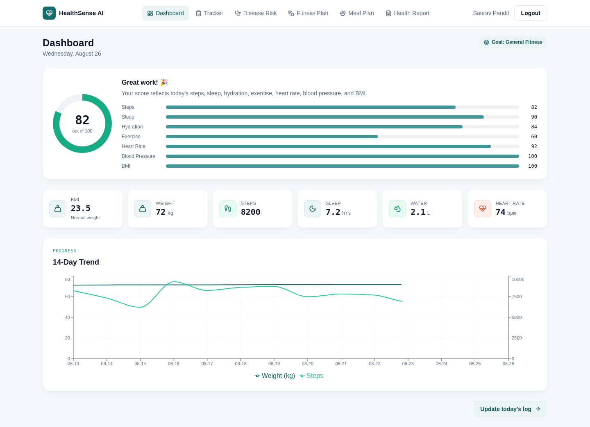
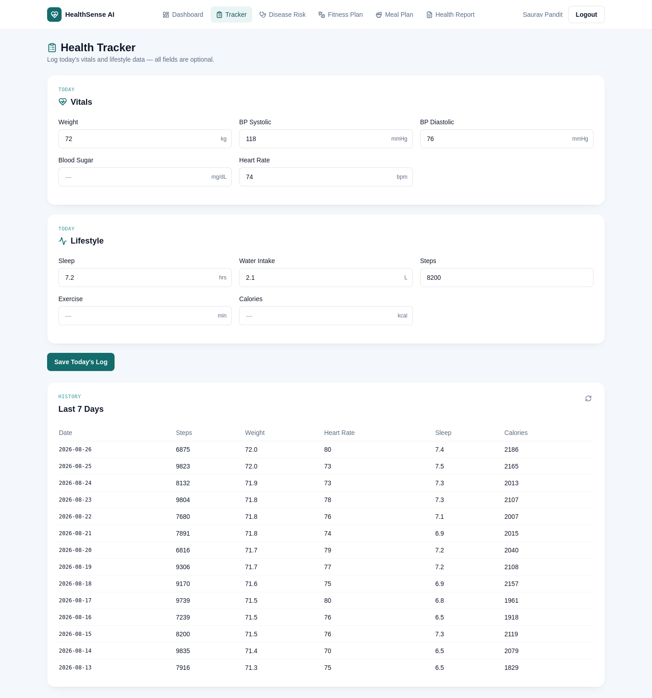
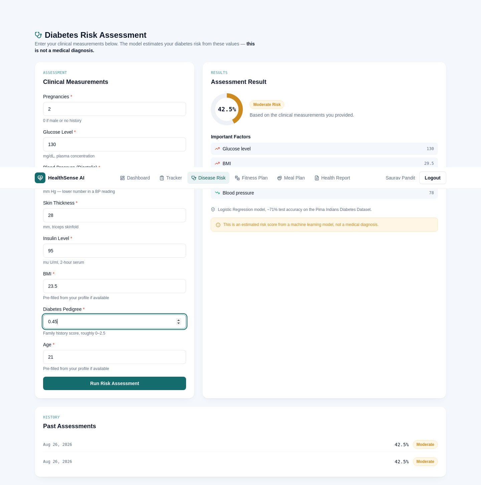
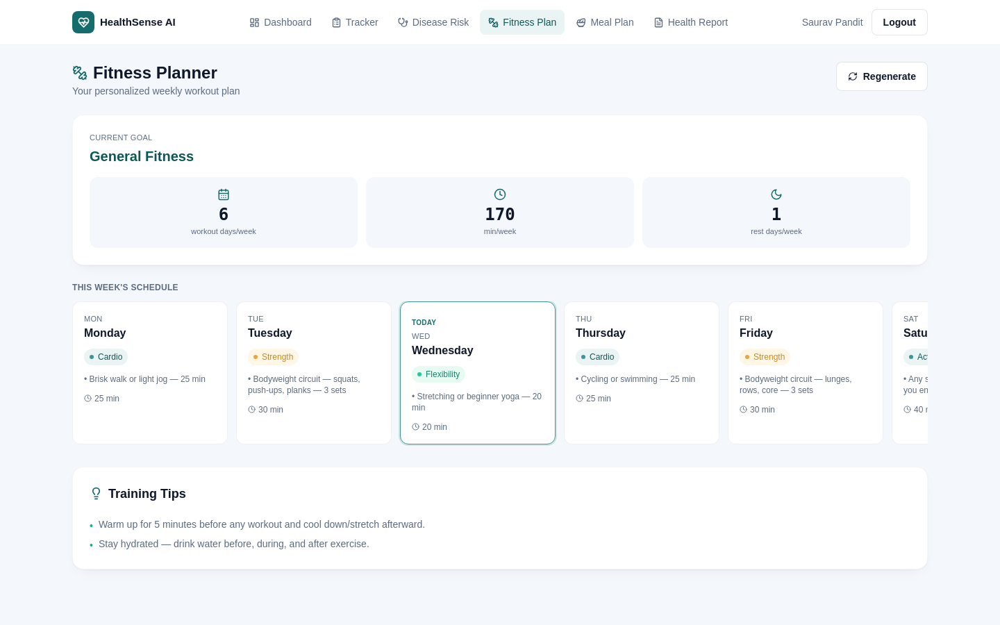
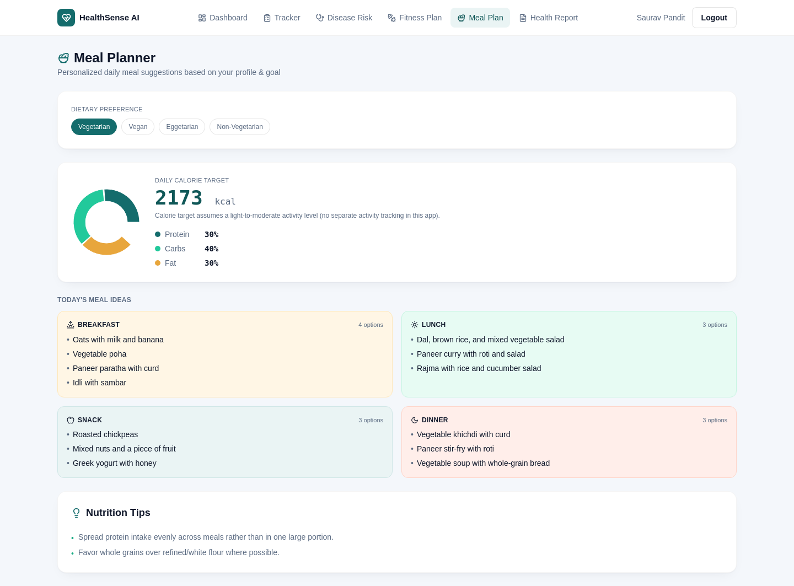
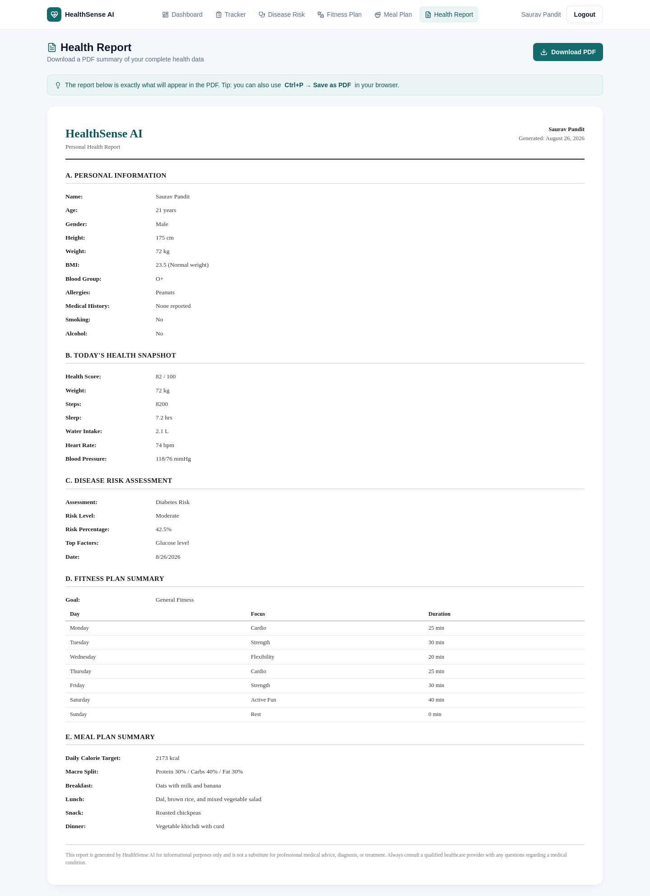

<div align="center">

# HealthSense AI

**AI-Powered Health Tracker, Disease Risk Prediction & Smart Wellness Planner**

A full-stack health platform that lets users track daily vitals, get an ML-driven diabetes risk assessment, and receive personalized fitness & meal plans — all in one dashboard.


</div>

> **This is an educational final-year project, not a medical device.** The disease risk model is trained on a public research dataset (not real clinical/hospital data), and every prediction is clearly labeled as an estimate, not a diagnosis. Always consult a qualified healthcare professional for real medical concerns.

---

## Features

| Module | What it does |
|---|---|
| **Authentication** | Register/login with JWT + bcrypt password hashing |
| **Health Profile** | Age, gender, height, weight, blood group, allergies, medical history, lifestyle, fitness goal |
| **Health Tracker** | Daily logging of weight, blood pressure, blood sugar, heart rate, sleep, water, steps, exercise, calories |
| **Dashboard** | Auto-calculated BMI, a weighted 0–100 Health Score, today's stats, and a 14-day trend chart |
| **Disease Risk Prediction** | Diabetes risk assessment via a Logistic Regression model, with per-user explainability (which factors increased/decreased *your* risk) |
| **Fitness Planner** | Rule-based weekly workout plan, personalized by goal and age |
| **Meal Planner** | Rule-based daily meal suggestions with calorie/macro targets, filtered against logged allergies |
| **Health Report** | One-click PDF export summarizing the entire profile, latest risk assessment, and plans |

## Screenshots

<table>
<tr>
<td></td>
<td></td>
</tr>
<tr>
<td></td>
<td></td>
</tr>
<tr>
<td></td>
<td></td>
</tr>
</table>

## The ML model — how it actually works

The Disease Risk module is trained on the real **Pima Indians Diabetes Dataset** (768 patient records, 8 clinical features), not synthetic data:

- **Algorithm**: Logistic Regression — chosen deliberately over a black-box ensemble model, because its coefficients are directly interpretable. That matters here: the app needs to explain *why* a risk was predicted, not just output a number.
- **Preprocessing**: several columns in this dataset use `0` as a placeholder for "not recorded" (e.g. 0 blood pressure is medically impossible) — these are detected and imputed with the column median before training.
- **Result**: **70.8% accuracy, 0.813 ROC-AUC** on a held-out 20% test set.
- **Feature importance** (by standardized coefficient magnitude): Glucose > BMI > Pregnancies > Family History (pedigree) > Age — which lines up with established clinical understanding of diabetes risk factors.
- **Per-prediction explainability**: rather than only showing global feature importance, each result shows *this specific user's* top contributing factors (coefficient × their standardized value), so a low glucose reading correctly shows as risk-*reducing* even though glucose's overall coefficient is positive.

## Tech stack

| Layer | Technology |
|---|---|
| Frontend | React 18, Vite, Tailwind CSS, React Router, Recharts, Axios, html2canvas + jsPDF |
| Backend | Node.js, Express, JWT, bcrypt |
| Database | MongoDB Atlas (Mongoose) |
| ML Service | Python, FastAPI, scikit-learn, pandas |
| Auth | JWT (access token) + bcrypt password hashing |

### Why two backends?

The Node/Express backend handles auth, CRUD, and business logic; the FastAPI service exists only to serve the trained ML model. The frontend never talks to FastAPI directly — every request goes through the Node backend, which proxies the ML call. This keeps a clean boundary: one service per concern, and the ML model can be retrained/redeployed independently of the main API.

## Project structure

```
healthsense-ai/
├── backend/                       Node.js + Express API
│   ├── app/                       (or src/, depending on your layout)
│   │   ├── models/                User, HealthLog, DiseaseRiskResult (Mongoose schemas)
│   │   ├── controllers/           One controller per module (auth, profile, tracker,
│   │   │                          dashboard, risk, fitness, meal)
│   │   ├── routes/                Route definitions per module
│   │   ├── middleware/            JWT auth middleware
│   │   └── utils/                 calculateBMI, calculateHealthScore,
│   │                              fitnessPlanGenerator, mealPlanGenerator
│   └── server.js
│
├── ml-service/                    FastAPI ML microservice
│   ├── app/
│   │   ├── main.py                API routes, model loading
│   │   ├── schemas.py             Pydantic request/response models
│   │   ├── data/diabetes.csv      Pima Indians Diabetes Dataset
│   │   └── model/                 Trained model artifact (.joblib)
│   └── train_model.py             Reproducible training script
│
└── frontend/                      React + Vite + Tailwind
    └── src/
        ├── api/client.js          Axios instance, auto-attaches JWT
        ├── context/AuthContext.jsx
        ├── components/ui/         Shared design system (Field, Card, States)
        └── pages/                 Login, Register, ProfileSetup, Dashboard, Tracker,
                                    DiseaseRisk, FitnessPlanner, MealPlanner, HealthReport
```

## Getting started

### Prerequisites
- Node.js 18+
- Python 3.10+
- A MongoDB Atlas connection string (free tier is enough)

### 1. Backend (Node/Express)

```bash
cd backend
npm install
cp .env.example .env     # fill in MONGO_URI, JWT_SECRET, ML_SERVICE_URL
npm run dev
```
Runs on `http://localhost:5000`.

### 2. ML Service (FastAPI)

```bash
cd ml-service
python -m venv .venv
source .venv/bin/activate      # Windows: .venv\Scripts\activate
pip install -r requirements.txt
python train_model.py          # trains and saves the model (only needed once)
python -m uvicorn app.main:app --reload --port 8000
```
Runs on `http://localhost:8000`.

> On Windows, if `uvicorn` isn't recognized as a direct command, always run it as `python -m uvicorn ...` as shown above.

### 3. Frontend (React)

```bash
cd frontend
npm install
npm run dev
```
Runs on `http://localhost:5173` and proxies `/api/*` to the backend.

**All three services need to be running** for the app to work end-to-end — the frontend needs the Node backend, and the Node backend needs the FastAPI service for the Disease Risk module specifically (every other module works without it).

## API overview

| Method | Endpoint | Description |
|---|---|---|
| `POST` | `/api/auth/register`, `/api/auth/login` | Auth |
| `GET` | `/api/auth/me` | Current session user |
| `GET`/`PUT` | `/api/profile` | Health profile |
| `POST`/`GET` | `/api/tracker`, `/api/tracker/today`, `/api/tracker/history` | Daily health logs |
| `GET` | `/api/dashboard/summary` | BMI, health score, today's snapshot |
| `POST`/`GET` | `/api/risk/diabetes`, `/api/risk/history` | Disease risk prediction |
| `GET` | `/api/fitness/plan` | Weekly workout plan |
| `GET` | `/api/meal/plan?preference=` | Daily meal plan |

All routes except register/login require an `Authorization: Bearer <token>` header.

## Design decisions worth knowing

- **Health Score** is a transparent weighted formula (steps, sleep, hydration, exercise, heart rate, blood pressure, BMI) — not a black box. If a user hasn't logged all fields, the score rescales to what's actually available rather than penalizing missing data.
- **One tracker entry per day** (`user` + `date` unique index) — later edits to the same day update the existing entry instead of creating duplicates, which keeps the trend chart clean.
- **Meal allergy filtering** uses a synonym map (e.g. an "egg" allergy also matches "omelette") rather than literal keyword matching alone — dish names don't always contain the allergen's name explicitly.
- **PDF export** renders the report with explicit inline styles (not Tailwind utility classes) inside the capture area, and waits for web fonts to finish loading before taking the snapshot — both were necessary for reliable, correctly-styled PDF output with `html2canvas`.

## Future scope

- Additional disease risk models (heart disease, hypertension) using the same explainable-model approach
- Admin panel for user/records management
- Expanded progress analytics (separate trend charts per metric)
- Wearable device integration for automatic tracker data

## License

MIT — built as an academic project, free to learn from and build on.

---

<div align="center">
<sub>Educational purposes only — not a substitute for professional medical advice.</sub>
</div>
